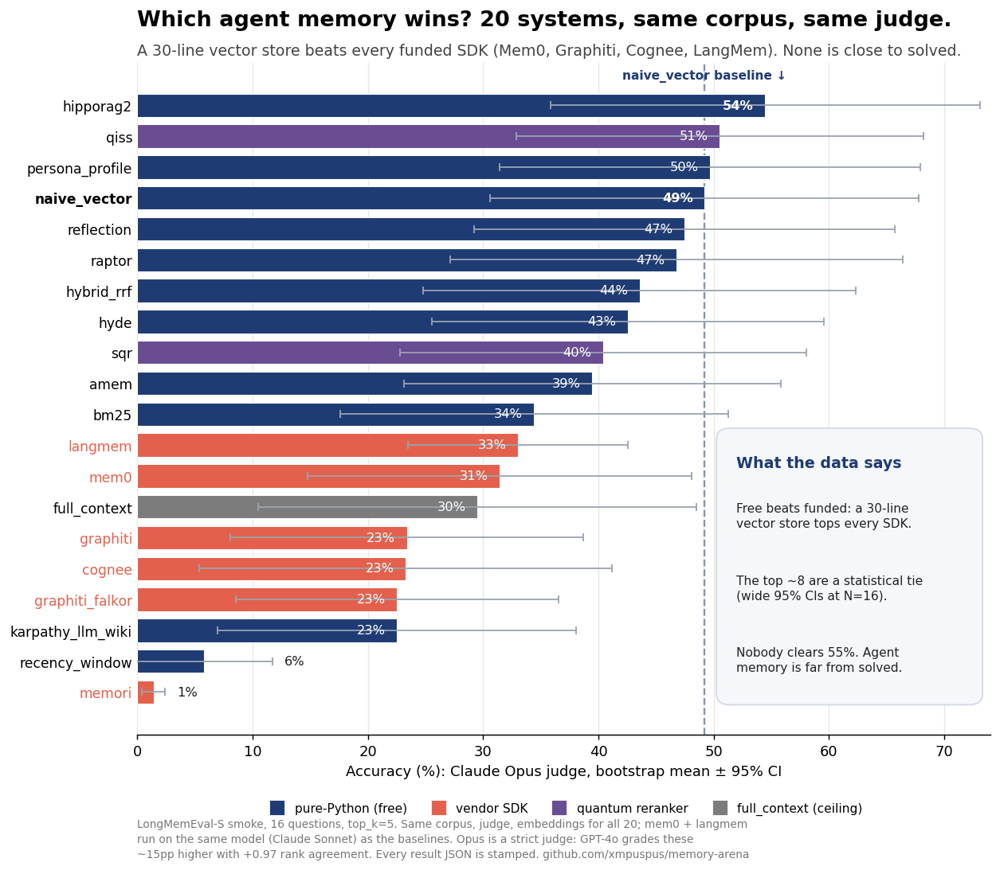
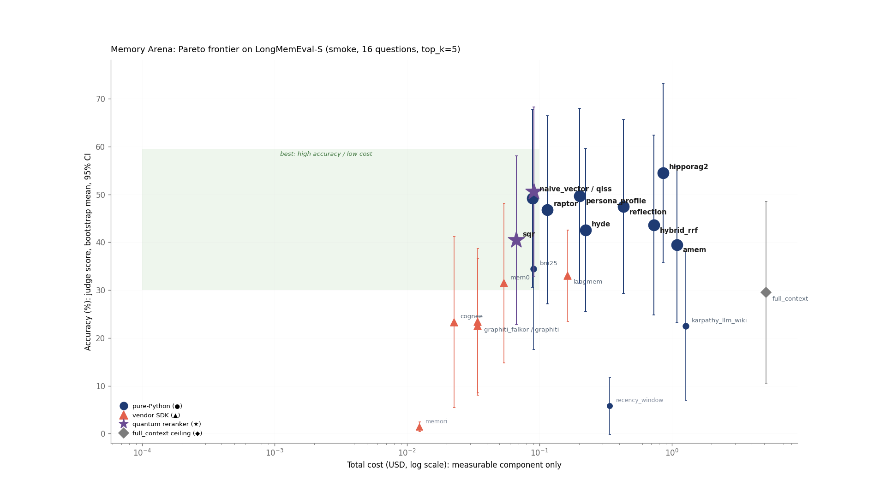
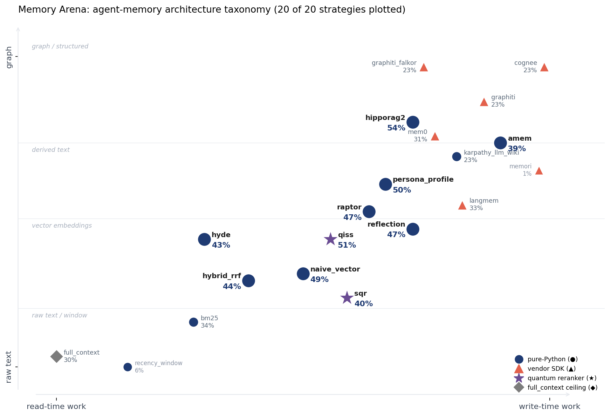
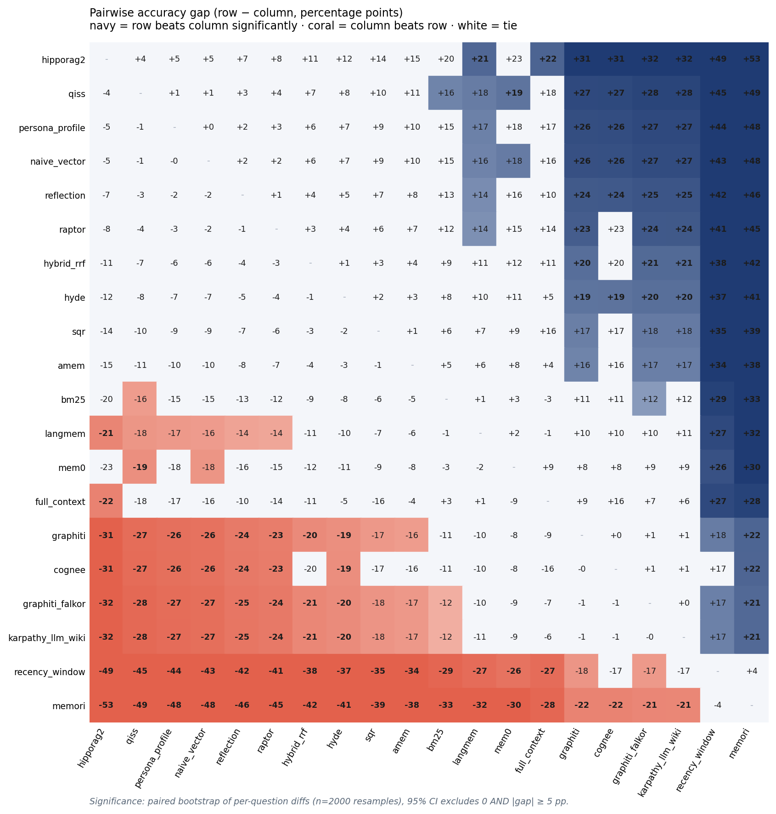
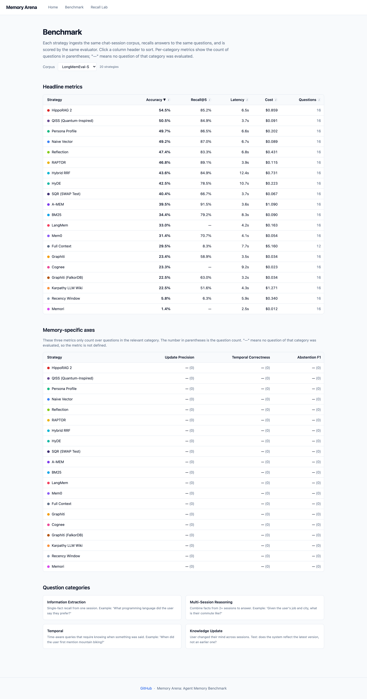

# Memory Arena

    

**A 30-line vector store beats every funded agent-memory SDK on the same eval. None of them is close to solving the problem.**

*Memory Arena is an open-source harness that runs 20 memory strategies through one lifecycle, one judge, one model, fully reproducible. Run it yourself, add your own strategy, or PR a vendor's tuned config and I'll re-run it.*

> **What this is.** Memory Arena runs 20 agent-memory strategies through
> the same `setup -> ingest -> recall -> teardown` lifecycle against
> the same chat-session corpus (LongMemEval-S smoke), judged by the
> same model (Claude Opus 4.7), with the same `top_k`. Six are vendor
> SDKs at their documented defaults (Mem0, Graphiti,
> Graphiti-on-FalkorDB, Cognee, LangMem, Memori). Twelve are pure-Python
> baselines and retrievers (vector, BM25, RRF, HyDE, RAPTOR, Reflection,
> Persona Profile, Karpathy's LLM Wiki, A-MEM, HippoRAG 2, full-context,
> recency window). Two are quantum rerankers over the same vector store
> (QISS, a pure-NumPy fidelity reranker; SQR, a Qiskit Aer SWAP-test
> reranker). Each result JSON is stamped with commit SHA, package
> versions, model IDs, and seed, so anyone can re-run and bisect.
>
> **What it isn't.** Not vendor-tuned. Not a single-judge truth
> (19-way Opus-vs-GPT-4o cross-judge Spearman is +0.967; GPT-4o runs
> more lenient in absolute terms but agrees on the ranking). Not a large-N study (the smoke subset is 16
> questions; the v0.2 full LongMemEval-S brings 500). Read [What this
> benchmark does NOT claim](#what-this-benchmark-does-not-claim)
> before quoting the numbers.

<p align="center">
  
</p>

<p align="center"><sub><b>20 systems, one eval.</b> Sorted by accuracy under the Opus judge. The funded vendor SDKs (coral) all land below `naive_vector`, a 30-line ChromaDB script; `mem0` and `langmem` run on the <i>same model</i> as the baselines, so it isn't a model handicap. Opus is a strict judge: GPT-4o grades these ~15pp higher with +0.967 rank agreement. Even the leader gets ~half right, memory is an open problem, not a shipped feature.</sub></p>

<p align="center">
  
</p>

<p align="center"><sub><b>The cost view.</b> Accuracy vs cost (log scale). The cheap pure-Python retrievers (navy) own the frontier; the vendor SDKs (coral) and full_context (grey) are <i>both</i> worse and no cheaper once you count their internal calls. <i>qiss lands on naive_vector because it <b>is</b> naive_vector (cosine fidelity can't reorder cosine); sqr trails. Why, in [`docs/quantum-and-compression.md`](docs/quantum-and-compression.md).</i></sub></p>

<p align="center">
  
</p>

<p align="center"><sub>The 20 strategies placed in one design space. <i>X-axis: when computation happens (read-time → write-time). Y-axis: representation (raw text → vectors → derived facts → graph).</i> The pattern: tier-1 accuracy spans the whole grid, no single quadrant wins.</sub></p>

## Rule of thumb: which agent memory should you use?

**Start with a plain vector store. Spend your effort on how the model reasons over what it retrieves, not on a fancier index. Add a graph only when the work is genuinely multi-hop. The expensive SDKs don't beat the free baseline.**

1. **Default to a plain vector store** (embed each turn, top-k cosine, ~30 lines). It beat every funded SDK here and costs almost nothing.
2. **Fix the reasoning, not the retrieval.** The right memory gets found 85-92% of the time; the model uses it correctly only ~half the time. A better answer prompt beats a fancier retriever.
3. **Reach for a knowledge graph only for multi-hop work.** A from-scratch HippoRAG 2 was the one thing that beat the vector baseline, on multi-session reasoning, at ~10x the cost.
4. **Pay a vendor SDK for managed infra, not accuracy.** On the same model, Mem0 / Graphiti / Cognee / LangMem didn't beat the free baseline. The convenience (extraction, updates, hosting) is real; the accuracy bump isn't.
5. **Never just stuff the whole conversation into context.** `full_context` is the worst trade on the board: most expensive, and lower accuracy than a cheap retriever.

Full decision tree and per-use-case matrix in [`docs/decision-guide.md`](docs/decision-guide.md).

## What's interesting in the data

> **One-liner:** *You don't need an agent-memory SDK to beat one. On this corpus a 30-line vector store tops every memory SDK, including Mem0 run on the exact same model.*

1. **The top tier is entirely pure-Python, and every vendor SDK lands below it.** `hipporag2` (54.5%), `qiss` (50.5%), `persona_profile` (49.7%), `naive_vector` (49.2%), `reflection` (47.4%), and `raptor` (46.8%) cluster at the top with overlapping 95% CIs. The funded vendor SDKs all score lower: Mem0 at 31.4% (and we put it on the *exact same model* as the baselines, Claude Sonnet, so it isn't a model handicap), below even `bm25`; the graph vendors at ~23%. A 30-line ChromaDB script beats all of them. Leveling cuts both ways, and we measured it: putting Mem0 on Sonnet barely moved it (~3pp; its drop from a naive-default 51% is mostly a v1->v2 regression, ~16pp), while `langmem` *rose* +6pp on Sonnet to 33% (the top vendor, still below `bm25`). `graphiti` and `cognee` can't be cleanly leveled in one environment (documented in the [methodology note](#methodology-note-leveling-mem0s-generator)); they stay vendor-default ~26pp back regardless.
2. **Pure-Python advanced retrievers don't separate from the simple vector store.** `hybrid_rrf` (~44%), `hyde` (~43%), `raptor` (~47%), and `reflection` (~47%) are all within ±5pp of plain `naive_vector` despite costing 1.5-8x more per run. At this sample size these are noise; worth re-checking on the full 500-question corpus.
3. **The "I'll just stuff the whole conversation in" baseline is dead.** `full_context` scores 29.5% at $5.16/run; every retrieval strategy beats it for 1-50% of the cost. Long-context isn't a substitute for retrieval, even when the model can hold it.
4. **Graph-shaped vendors (graphiti, cognee, karpathy_llm_wiki) underperform on this slice.** Both temporal-graph vendors land at ~23% and the LLM-maintained wiki at ~22%; about half of `naive_vector`. **This is a measurement boundary, not a verdict.** The smoke corpus contains only 4 multi-session-reasoning questions out of 16; graph approaches earn their write-time cost on multi-hop synthesis the v0.2 full corpus (500 questions, ~125 multi-session) will exercise. The graph-vs-vector head-to-head you actually want is in v0.2; treat the smoke numbers for graph systems as a lower bound on what the architecture can do.
5. **The quantum rerankers land exactly where the math predicts, no advantage hiding.** `qiss` (quantum-inspired, pure NumPy) reranks `naive_vector`'s candidates by cosine-squared state fidelity; its single-query ordering equals `naive_vector`'s by construction, so its 50.5% (3-seed mean, 95% CI overlapping the whole top tier) is statistically tied with `naive_vector`'s 49.2%, and its Recall@5 matches `naive_vector`'s within retrieval noise. `sqr` (a real SWAP-test circuit on the Qiskit Aer simulator) drops to 40.4%: amplitude-encoding forces a PCA squeeze of 3072-d embeddings into a 16-amplitude 4-qubit register, which keeps only **36% of the variance** (measured, `results/longmemeval-s_quantum_diagnostics.json`), and the reranker eats that loss. The honest read: simulated quantum machinery buys nothing over the closed-form cosine on this task; the interesting number is the dimensionality-reduction tax, not a quantum win.
6. **Retrieval is mostly solved; reasoning over the retrieved memory is the bottleneck.** Across six top-tier strategies, recall@5 is 85-92% while accuracy is only 47-51%. Restricting to just the questions where the correct session *was* retrieved barely moves accuracy (~48-54% mean), and they still score below half marks on roughly half of those questions. The hard part isn't finding the memory, it's answering correctly once you hold it. (`hipporag2` is the exception that proves it: same recall (~85%), but 63% accuracy on the perfect-recall subset, the best at *using* what it retrieves. N=16, so directional; computed from the per-question `recall_records` in `results/`.)

<p align="center">
  
</p>

<p align="center"><sub><b>Pairwise significance heatmap.</b> Read row "A" vs column "B": navy = A beats B with 95% bootstrap CI excluding 0; coral = B beats A; white = statistical tie. The white block in the upper-left is the "tier 1 is tied" claim, visually verified.</sub></p>

## What this benchmark does NOT claim

- **Not "vendor SDK X is bad."** We report vendor-default behavior on a single corpus. A tuned config is a separate measurement; vendor PRs are explicitly invited (see [Vendors: PR your tuned config](#vendors-pr-your-tuned-config)).
- **Not "the top tier is equivalent."** N=16 makes 95% CIs wide; we report a statistical *tie* at this sample size, not equivalence. The full LongMemEval-S (500 questions) ships in v0.2 with CIs tight enough to rank within tier 1.
- **Not "graph memory is dead."** `graphiti` and `cognee` score lower than vector retrievers on this slice. The smoke subset has 4 multi-session-reasoning questions; graph approaches need many more to demonstrate their advantage. The full LongMemEval-S (500 questions, ~125 multi-session) and LongMemEval-M (multi-hop heavy) ship in v0.2.
- **Not "every vendor is on the same model."** `mem0` and `langmem` now extract on Claude Sonnet, leveled to the harness (see the [methodology note](#methodology-note-leveling-mem0s-generator)). `graphiti` and `cognee` can't be cleanly leveled in one environment (graphiti-core 0.13 ships no Anthropic client, and 0.17, which does, is a version confound; cognee 1.0.3 needs a newer starlette than the pinned fastapi allows), so they run vendor-default (gpt-4o / gpt-4o-mini). Read those two rows as vendor-default, not model-controlled; both sit ~26pp below the top tier regardless of model.
- **Not "a single judge is bias-free."** Opus 4.7 grades every answer, but 19 of the 20 strategies were re-graded by **GPT-4o** and the ranking holds: **Spearman rho = +0.967** ([`results/cross_judge_report.json`](results/cross_judge_report.json)). GPT-4o runs ~10-25pp more lenient in absolute terms but agrees on order, and independently ranks every vendor SDK below the pure-Python tier (sqr's results lack a seed suffix, so the seed-based re-grade skips it). See Zheng et al. (NeurIPS 2024, [arXiv:2306.05685](https://arxiv.org/abs/2306.05685)) for the judge-bias framework.
- **Not "the configurations are tuned."** They are documented vendor defaults plus the deviations listed in [Configurations](#configurations) below.
- **Not "this generalizes to all memory workloads."** Chat sessions are one slice; tool-use traces, codebases, and long documents are not in scope.
- **Not "rank N vs N+1 is meaningful at the smoke scale."** With 20 benchmarked strategies pairwise-compared on 7 metrics, family-wise error rates require Benjamini-Hochberg correction (queued for v0.2 alongside the paired bootstrap). Treat within-tier ranks as unordered.

## Configurations

Vendor-default everywhere except where flagged. `top_k=5` held constant across all strategies for the headline run. Same OpenAI `text-embedding-3-large` (3072 dims) for every embedding-based strategy. Same Anthropic `claude-sonnet-4-6` for the recall-step generator unless the SDK pins its own. Same Anthropic `claude-opus-4-7` as the LLM judge.

| Strategy | top_k | Embedding model | Generator | Judge | Max tokens (gen) | Notes |
| --- | --- | --- | --- | --- | --- | --- |
| `full_context` | n/a | n/a | sonnet-4-6 | opus-4-7 | 4096 | Stuffs every turn into the prompt up to `full_context_token_budget=150000`. |
| `recency_window` | n/a | n/a | sonnet-4-6 | opus-4-7 | 4096 | Last `recency_window_n=20` turns only. |
| `naive_vector` | 5 | text-embedding-3-large | sonnet-4-6 | opus-4-7 | 4096 | ChromaDB collection `naive_<run_id>`. |
| `bm25` | 5 | n/a (lexical) | sonnet-4-6 | opus-4-7 | 4096 | rank-bm25 in-process. |
| `hybrid_rrf` | 5 | text-embedding-3-large | sonnet-4-6 | opus-4-7 | 4096 | RRF k=60. Inner top_k = `max(top_k * 4, 20) = 20` per branch. |
| `hyde` | 5 | text-embedding-3-large | sonnet-4-6 | opus-4-7 | 4096 | Hypothetical answer drafted by sonnet, then embedded for retrieval. |
| `persona_profile` | 5 | text-embedding-3-large | sonnet-4-6 | opus-4-7 | 4096 | Haiku 4.5 builds the one-shot user profile (~15K-char buffer) before first recall. |
| `reflection` | 5 | text-embedding-3-large | sonnet-4-6 | opus-4-7 | 4096 | Reflection summary written every 4 sessions by sonnet, indexed alongside raw turns. |
| `raptor` | 5 | text-embedding-3-large | sonnet-4-6 | opus-4-7 | 4096 | scikit-learn k-means, 4 levels, branch=4. Cluster summaries via Haiku 4.5. |
| `karpathy_llm_wiki` | 5 | n/a (markdown wiki) | sonnet-4-6 | opus-4-7 | 4096 | Haiku 4.5 picks pages, sonnet writes answers. Lint pass every 10 sessions over the 30 largest pages. |
| `mem0` | 5 | text-embedding-3-large | sonnet-4-6 | opus-4-7 | vendor | mem0ai 2.0.2 (v2). Internal fact-extraction runs on Claude Sonnet, **leveled to the harness** (v2's Anthropic adapter is fixed). See [methodology note](#methodology-note-leveling-mem0s-generator). |
| `graphiti` | 5 | text-embedding-3-large | **gpt-4o** | opus-4-7 | **16384** | Deviates from doc default: `max_tokens=16384` (paper default 8192) plus 2-turn (user+assistant) chunked episodes to keep entity-extraction under the cap. Cost-driven trade-off. |
| `graphiti_falkor` | 5 | text-embedding-3-large | **gpt-4o** | opus-4-7 | **16384** | Identical config to `graphiti` but on graphiti-core 0.17 with the FalkorDB driver (host port 6381) instead of Neo4j. Separate env (needs pydantic 2.11+). |
| `cognee` | 5 | text-embedding-3-large (3072 dims) | gpt-4o-mini | opus-4-7 | vendor | `add` -> `cognify` -> `search(GRAPH_COMPLETION)`. networkx graph (default). |
| `langmem` | 5 | text-embedding-3-large | sonnet-4-6 | opus-4-7 | vendor | LangGraph `InMemoryStore` + `create_memory_store_manager(anthropic:claude-sonnet-4-6)`, **leveled to the harness**. |
| `memori` | 5 | vendor-internal (cloud) | gpt-4o-mini | opus-4-7 | vendor | Memori 3.x augmentation runtime owns embedding internally; we cannot pin it to ours. Without `MEMORI_API_KEY` the augmentation is throttled near zero. |

### Methodology note: leveling mem0's generator

A clean comparison routes every strategy's internal LLM calls through the
same model so the only variable is the memory architecture. Older runs of
`mem0` could not: `mem0ai` v1 (`0.1.114`) had an Anthropic-adapter bug that
forced its internal fact-extraction onto OpenAI `gpt-4o-mini`, while
pure-Python rows ran end-to-end on Sonnet 4.6. v2 (`2.0.2`) fixes that
adapter, so `mem0` now extracts on Claude Sonnet, the same model as the
baselines. Embeddings (`text-embedding-3-large`) are pinned across the table.

We measured the confound directly instead of guessing at it (3-seed and
5-seed runs):

| mem0 config | accuracy | recall@5 |
| --- | --- | --- |
| v1 + gpt-4o-mini (the old published number) | 50.9% | 91% |
| v2 + gpt-4o-mini | 34.6% | 80% |
| v2 + Sonnet (leveled, **what the table now shows**) | 31.4% | 71% |

- **The model swap is small, ~3pp.** Holding the version at v2, moving
  extraction from gpt-4o-mini to Sonnet costs 2.7-3.2pp across 5 seeds. So
  mem0's score was never a model artifact; the generator the field worried
  about barely moves it.
- **The version is the real story, ~16pp.** mem0 v2's OSS rewrite (which
  removed the graph store and consolidates facts more aggressively) scores
  ~16pp lower than v1 on this haystack corpus, regardless of model. We
  benchmark v2 because it is what `pip install 'memory-arena[mem0]'` gives
  you today; pinning the deprecated v1 to keep a flattering 51% would test
  software nobody installs.
- **Cost** (~$0.05/run) counts only memory-arena's own generation calls;
  mem0's internal Sonnet extraction is not counted (footnote `‡`).

`langmem` is leveled the same way, and it cut the other direction: on Sonnet it
*rose* +6pp (26.9% -> 33.0%), the top vendor on the board, so its default model
was selling it short. `graphiti` and `cognee` can't be cleanly leveled in this
environment: graphiti-core 0.13 has no Anthropic client (0.17 does, but the
version jump is itself a confound, like mem0 v1->v2), and cognee 1.0.3 needs a
newer starlette than the pinned fastapi allows, so it only runs in its own venv.
Both stay at their benchmarked vendor default; leveling them needs a separate
environment and is the one remaining gap. `mem0g` (mem0 v1 graph memory) is excluded from the
leaderboard entirely: v2 removed the OSS graph store, so it can only run on
the deprecated v1 + gpt-4o-mini, and graph memory is already covered by
`graphiti`.

### Statistical methodology

- **Bootstrap.** For strategies with 3 seeds, we compute the per-seed
  per-question accuracy, then resample question IDs with replacement
  (2000 iterations) and compute the mean. The 95% CI is the
  2.5th-97.5th percentile of the bootstrap distribution. Single-seed
  strategies show no CI; their numbers are point estimates.
- **What CI width to expect.** With N=16 questions per seed and three
  seeds, the median 95% CI half-width on the accuracy axis is ~18 pp.
  Strategies with low variance across seeds (e.g. `raptor`,
  `recency_window`, `bm25`) collapse to <1 pp; strategies whose
  performance hinges on stochastic extraction (e.g. `mem0`, `hyde`)
  end up >15 pp. The full LongMemEval-S (500 questions, v0.2)
  shrinks every row's CI by a factor of ~5.6.
- **Pairwise comparisons.** The pairwise heatmap
  ([`docs/pairwise.png`](docs/pairwise.png)) uses a paired bootstrap
  of per-question accuracy differences (2000 resamples), reporting a
  cell as "significant" only if the 95% CI excludes 0 AND the absolute
  gap exceeds 5 percentage points. This is more conservative than
  treating overlapping seed-level CIs as non-significance.
- **Multiple-comparisons correction.** With 20 benchmarked strategies and 7 axes,
  pairwise tests imply up to 20 x 19 / 2 x 7 = 1330 implicit
  hypotheses if every cell were treated independently. The published
  pairwise heatmap is *informally* corrected by the 5 pp gap floor; a
  formal Benjamini-Hochberg q-value column ships in v0.2. Until
  then, treat the pairwise heatmap as a screening tool, not a
  defendable rank.
- **Single judge bias.** Opus 4.7 is the single judge. Re-grading 19
  of the 20 strategies with GPT-4o yields Spearman rho = +0.967 on the
  ranks (see
  [`results/cross_judge_report.json`](results/cross_judge_report.json));
  GPT-4o grades higher in absolute terms but agrees on order. The
  framework for quantifying judge bias is Zheng et al. (NeurIPS 2024,
  [arXiv:2306.05685](https://arxiv.org/abs/2306.05685)).
- **Reproducibility.** Every per-seed result file under `results/`
  carries a `metadata` block with `commit_sha`, `seed`,
  `package_versions`, `models`, `top_k`, `host`, `python`, and
  timestamp. Re-running `scripts/aggregate_bootstrap.py` from a fresh
  checkout reproduces the headline numbers from the per-seed files;
  re-running the bench against the same seed reproduces those.

No API keys, no Docker, no corpus download. The package ships with a smoke result snapshot and the dashboard renders it from the bundled FastAPI server:

```bash
pip install memory-arena
memory-arena demo
```

The dashboard lives at `http://localhost:8000/`. Three pages: Home (20 strategy cards, 4 question categories evaluated), Benchmark (sortable table with 95% CIs + cost + latency), Recall Lab (per-question HIT/MISS drill-down).

<p align="center">
  
</p>

<p align="center"><sub><i>The bundled dashboard's Benchmark page, sortable by any column. <code>memory-arena demo</code> serves it from the snapshot with no API keys. Also: <a href="docs/screenshot-home.png">home</a> (20 strategy cards) and <a href="docs/screenshot-recall-lab.png">recall lab</a> (per-question HIT/MISS).</i></sub></p>

---

## Real benchmark numbers

LongMemEval-S smoke subset: **16 questions across 4 categories**: 4
questions each from `information_extraction`, `multi_session_reasoning`,
`temporal`, and `knowledge_update`. 82 sessions. Judge:
`claude-opus-4-7`. 3-seed bootstrap where available (13/20 benchmarked strategies);
remaining strategies are single-seed. CIs are 95% bootstrap. `top_k=5`
held constant across all strategies.

> **Read this first.** N=16 yields a median 95% bootstrap CI half-width
> of ~18 pp on accuracy, so the top tier is a wide statistical tie.
> `hipporag2` posts the top point estimate (54.5%, 3 seeds) but its
> CI overlaps `qiss`, `persona_profile`, `naive_vector`, `reflection`,
> and `raptor`, all pure-Python. Every vendor SDK sits below this tier.
> Treat the leaderboard as "tier 1 is a ~47-55% pure-Python tie; clear
> gap to bm25; vendors below; floor at recency_window."
> Cross-judge sanity check: re-grading 19 of the 20 strategies with
> **GPT-4o** instead of Opus 4.7 gives **Spearman rho = +0.967** on the
> ranks (see [`results/cross_judge_report.json`](results/cross_judge_report.json)).
> The full 500-question LongMemEval-S lands in v0.2 with CI half-widths
> small enough to rank within tier 1. See [Statistical
> methodology](#statistical-methodology) for the bootstrap recipe,
> multiple-comparison handling, and known limits.

<!-- BENCHMARK_TABLE_START -->
| Strategy | Accuracy (95% CI) | Recall@5 | Cost | Latency | Status | What it does |
| --- | --- | --- | --- | --- | --- | --- |
| `hipporag2` | 54.5% ±18.6 | 85.2% | $0.859 | 6542ms | ok | HippoRAG 2 (ICML 2025): extracts entity triples into a graph and ranks passages by personalized PageRank. |
| `qiss` | 50.5% ±17.7 | 84.9% | $0.091 | 3724ms | ok | Reranks vector hits by quantum fidelity (cosine squared) over the same embeddings; pure NumPy, optional multi-query superposition fusion. |
| `persona_profile` | 49.7% ±18.2 | 86.5% | $0.202 | 6554ms | ok | Builds a one-page bio of the user up front and pastes it into every answer. |
| `naive_vector` | 49.2% ±18.6 | 87.0% | $0.089 | 6653ms | ok | Embeds every message and pulls the closest matches by cosine similarity. |
| `reflection` | 47.4% ±18.2 | 83.3% | $0.431 | 6838ms | ok | Periodically writes journal-style summaries of recent sessions, then searches both. |
| `raptor` | 46.8% ±19.6 | 89.1% | $0.115 | 3861ms | ok | Hierarchical k-means clustering with LLM cluster summaries (Sarthi et al. 2024). |
| `hybrid_rrf` | 43.6% ±18.8 | 84.9% | $0.731 | 12360ms | ok | Reciprocal rank fusion of vector + BM25. Blended ranking. |
| `hyde` | 42.5% ±17.0 | 78.5% | $0.223 | 10652ms | ok | Guesses what the answer might look like first, then searches for messages like the guess. |
| `sqr` | 40.4% ±17.6 | 66.7% | $0.067 | 3714ms | ok | Reranks vector hits with a real SWAP-test circuit on the Qiskit Aer simulator (PCA-reduced amplitude encoding, exact statevector). |
| `amem` | 39.5% ±16.3 | 91.5% | $1.09 | 3634ms | ok | A-MEM (NeurIPS 2025): writes an LLM note per memory and periodically links and revises related notes. |
| `bm25` | 34.4% ±16.8 | 79.2% | $0.090 | 8299ms | ok | Old-school keyword search. What Google did before vectors. |
| `langmem` | 33.0% ±9.5 | -§ | $0.163‡ | 4227ms | ok | LangChain's memory store: extracts facts as they happen and recalls them by similarity. |
| `mem0` | 31.4% ±16.7 | 70.7% | $0.054‡ | 4082ms | ok | Vendor SDK that extracts standalone facts and stores them as memories. |
| `full_context` | 29.5% ±19.0 | 8.3% | $5.16 | 7664ms | ok | Pastes the entire chat history into every prompt. Ceiling reference; expensive. |
| `graphiti` | 23.4% ±15.3 | 58.9% | $0.034‡ | 3489ms | ok | Temporal knowledge graph with valid_at/invalid_at edges (Zep OSS). |
| `cognee` | 23.3% ±17.9 | -§ | $0.023‡ | 9205ms | ok | Knowledge-graph memory: add → cognify → search(GRAPH_COMPLETION). |
| `graphiti_falkor` | 22.5% ±14.0 | 63.0% | $0.034‡ | 3223ms | ok | Same Graphiti algorithm on FalkorDB (Redis graph engine) instead of Neo4j; isolates the database to test the engine's latency claim. |
| `karpathy_llm_wiki` | 22.5% ±15.5 | 51.6% | $1.27 | 4263ms | ok | LLM maintains a markdown wiki of entity pages with cross-links and citations. |
| `recency_window` | 5.8% ±5.9 | 6.2% | $0.340 | 5894ms | ok | Only remembers the last 20 messages. Floor baseline. |
| `memori` | 1.4% ±1.0 | -§ | $0.012‡ | 2472ms | ok | SQL-native fact store with augmentation pipeline. ‖ |

**Footnotes.** **‡** memory-arena-paid generation cost only; vendor SDKs run additional internal LLM calls (mem0 extraction, graphiti entity extraction, langmem fact extraction, cognee cognify, etc.) that aren't counted. True cost is this number plus the vendor-internal component. **§** Recall@k requires the strategy to return chat-session pointers; LangMem/Cognee/Memori store extracted facts, neither maps to LongMemEval session IDs. **‖** memori at this score reflects the no-`MEMORI_API_KEY` baseline (cloud augmentation throttled to ~zero). Set the key for the vendor's intended throughput; PRs welcome.

_20 strategies. 13/20 strategies have 3-or-more-seed bootstrap CIs; the rest are single-seed (no CI). top_k=5 held constant. Judge: claude-opus-4-7. Generation: claude-sonnet-4-6 (strategies that route through their own SDK use the SDK default). Hardware/SDK versions stamped in `results/<strategy>_summary.json` `metadata` block._
<!-- BENCHMARK_TABLE_END -->

**FalkorDB vs Neo4j, version-controlled.** The `graphiti` row pins
graphiti-core 0.13 (the published baseline); `graphiti_falkor` needs 0.17,
the first release with the FalkorDB driver. So the two rows are not a clean
engine comparison: graphiti-core 0.17 by itself lifts Neo4j from 23.4% to
26.7% accuracy and 3489ms to 3054ms latency. Re-running `graphiti` on Neo4j
under the same 0.17 gives 26.7% / 66.1% recall@5 / 3054ms vs `graphiti_falkor`
at 22.5% / 63.0% / 3223ms. Under one library version the two engines are
statistically tied (16 questions, single seed, ~14pp CI half-width), with
Neo4j marginally ahead on every axis and zero ingest failures (FalkorDB's
driver hits ~1.2%). FalkorDB's headline graph-query latency advantage does
not surface end-to-end because the answer-generation LLM call dominates recall
latency. No measurable FalkorDB win at this level of measurement.

The vendor caveat: rows labeled `config-failed-at-default` (none in the
current run) reflect a vendor's shipped default config breaking ingest at
install time, not what the SDK can do when tuned. PRs that ship a working
default for any vendor in that bucket are welcome, see
[CONTRIBUTING.md](CONTRIBUTING.md). The table answers the question "what
does memory-arena measure when I run the documented install command?",
not "what's the maximum each vendor SDK can achieve."

### Sanity check vs the LongMemEval paper

The LongMemEval paper (Wu et al., ICLR 2025; Table 3) reports plain
semantic-retrieval baselines on the M variant of the corpus. Their
session-granularity vector retriever lands at **Recall@5 = 0.706** with
**GPT-4o reader/judge accuracy = 0.670**. Our `naive_vector` on
LongMemEval-S smoke gets **Recall@5 = 0.870** (we use the newer
`text-embedding-3-large`) and **49.2% accuracy under Opus 4.7 as judge**.
The Opus judge is stricter than the paper's GPT-4o; we treat ours as a
floor, not a comparable. A 19-way cross-judge under GPT-4o gives
Spearman rho = +0.967 on the ranks (GPT-4o more lenient, same order). The underlying retrieval is, if
anything, slightly better than the paper's because of the newer
embedding model.

### Dig deeper

| Want… | Read |
|-------|------|
| Why mem0 wins question X but loses question Y | [`docs/case-studies.md`](docs/case-studies.md): 4 questions, side-by-side answers |
| Which architecture to pick for your use case | [`docs/decision-guide.md`](docs/decision-guide.md): decision tree + use-case matrix |
| What every strategy answered for every question | [`docs/per-question-comparison.md`](docs/per-question-comparison.md): static "ask all 16" page |
| Common objections + answers | [`docs/FAQ.md`](docs/FAQ.md): 18 pre-empted questions |
| Do the quantum strategies beat cosine? (no, and why) | [`docs/quantum-and-compression.md`](docs/quantum-and-compression.md): root cause, literature, and the compression cost frontier |
| Vendor SDK pin reasons + breakages | [`docs/vendor-pins.md`](docs/vendor-pins.md) |

## How memory-arena measures

Every strategy goes through the same lifecycle:

```
setup(run_id) -> ingest_session(...) sequentially -> recall(query) -> teardown()
```

Same OpenAI `text-embedding-3-large` for vectors that need them. Same
Anthropic Sonnet 4.6 for generation. Same Anthropic Opus 4.7 for the
LLM judge.

### The 7-axis evaluator

1. **Structural**, `must_mention`, `must_not_claim`, `max_tokens`
2. **Sources**, at least one labeled `supporting_session_id` retrieved
3. **LLM judge**, Opus 4.7 grades 0..100 against the reference
4. **Eval memo**, identical (answer, reference) pairs cached in-process
5. **Temporal correctness**, claimed time-marker overlaps the ground-truth window
6. **Update precision**, answer reflects the latest fact version
7. **Abstention F1**: F1 over abstention questions. Returns `null` when
   no abstention question is evaluated; the current smoke subset has no
   abstention category (returns null across all rows). The v0.2
   sweep restores 4 abstention questions per seed.

### The 20 strategies

#### Pure-Python baselines and retrievers

| Strategy             | Backing                  | Notes                                                 |
| -------------------- | ------------------------ | ----------------------------------------------------- |
| `full_context`       | in-process               | Stuff every turn into the prompt up to the budget.    |
| `recency_window`     | in-process               | Last N turns. Cheapest baseline.                      |
| `naive_vector`       | local Chroma             | Embed every turn, top-k cosine.                       |
| `bm25`               | in-process               | Pure-Python lexical baseline.                         |
| `hybrid_rrf`         | local Chroma + rank-bm25 | Reciprocal Rank Fusion of vector + BM25.              |
| `hyde`               | local Chroma             | Hypothetical Document Embeddings, guess answer first, embed that. |
| `persona_profile`    | local Chroma             | One-shot persona stuffed as system context for every recall. |
| `reflection`         | local Chroma             | Synthetic LLM-authored summaries every 4 sessions, indexed alongside raw turns. |
| `raptor`             | scikit-learn             | Hierarchical k-means clustering with LLM cluster summaries. |
| `karpathy_llm_wiki`  | local markdown wiki      | LLM maintains a markdown wiki with `[[wikilinks]]` and `[session=...]` citations. ([pattern](https://gist.github.com/karpathy/442a6bf555914893e9891c11519de94f)) |
| `amem`               | local Chroma             | A-MEM (NeurIPS 2025): LLM-authored memory notes with a periodic link-evolution pass. |
| `hipporag2`          | networkx                 | HippoRAG 2 (ICML 2025): open-IE triples plus personalized PageRank over an entity graph. |

#### Quantum rerankers (over `naive_vector`)

Both coarse-retrieve `top_k x fanout` candidates from `naive_vector`'s Chroma
index, then rerank by a quantum-state fidelity. They share the vector store, so
the retrieval substrate is identical and only the reranking math differs.

| Strategy | Backing                  | Notes                                                 |
| -------- | ------------------------ | ----------------------------------------------------- |
| `qiss`   | local Chroma + NumPy     | Quantum-Inspired Semantic Similarity. Reranks by fidelity Tr(rho_q rho_d) = cosine squared. Pure NumPy, no new deps; optional multi-query superposition adds interference cross-terms. |
| `sqr`    | local Chroma + Qiskit Aer | Simulated Quantum Reranker. SWAP-test circuit on the Aer simulator (exact statevector); embeddings PCA-reduced to 2^n_qubits dims and amplitude-encoded. Needs `pip install 'memory-arena[quantum]'`. |

#### Vendor SDKs

| Strategy           | Backing                       | Notes                                            |
| ------------------ | ----------------------------- | ------------------------------------------------ |
| `mem0`             | Chroma                        | mem0ai v2; internal fact-extraction leveled to Claude Sonnet. |
| `graphiti`         | Neo4j                         | Temporal knowledge graph (Zep OSS).              |
| `graphiti_falkor`  | FalkorDB                      | Same algorithm as `graphiti` on a Redis-based graph engine; isolates Neo4j vs FalkorDB. |
| `cognee`           | networkx (default) / Neo4j    | `add` → `cognify` → `search(GRAPH_COMPLETION)`.  |
| `langmem`          | LangGraph InMemoryStore       | `create_memory_store_manager(anthropic:claude-sonnet-4-6)`, leveled; text-embedding-3-large. |
| `memori`           | Postgres                      | SQL-native, augmentation pipeline. Cloud-quota throttled without `MEMORI_API_KEY`. |

## Quick start (local)

```bash
git clone https://github.com/xmpuspus/memory-arena
cd memory-arena
pip install -e '.[dev]'

# The benchmark makes real LLM + embedding calls, so set provider keys first
# (pydantic-settings reads them from the environment or a local .env file):
export ANTHROPIC_API_KEY=...   # Claude: generation + judge
export OPENAI_API_KEY=...      # embeddings (text-embedding-3-large)

# Bring up Neo4j (graphiti) and Postgres-pgvector (memori)
docker compose up -d neo4j postgres

# Pull the LongMemEval corpus and ingest the smoke subset
memory-arena download-longmemeval
memory-arena ingest-sessions --corpus longmemeval-s

# Pure-Python strategies, 3-seed bootstrap
for SEED in 0 1 2; do
  memory-arena benchmark --corpus longmemeval-s \
    --strategy 'bm25,naive_vector,recency_window,hybrid_rrf,hyde,persona_profile,reflection,raptor,karpathy_llm_wiki' \
    --cost-cap 3 --top-k 5 --seed $SEED
done

# Vendor SDK strategies
pip install 'memory-arena[mem0,graphiti,cognee,langmem,memori]'
for SEED in 0 1 2; do
  memory-arena benchmark --corpus longmemeval-s \
    --strategy 'mem0,graphiti,langmem,memori' \
    --cost-cap 3 --top-k 5 --seed $SEED
done

# Aggregate to per-strategy summaries with 95% CIs
python scripts/aggregate_bootstrap.py

# Render the README headline table from those summaries
python scripts/render_readme.py

# Build the hero chart from the same summaries
python scripts/build_hero_chart.py

# Launch the dashboard
memory-arena serve
```

Every result JSON is stamped with the commit SHA, installed package
versions, model IDs, host info, and seed under `metadata`. If your
numbers differ from the published table, post the diff and we'll bisect.

## Why this exists

A simple chart someone can send when asked "which memory SDK should I
pick?" Vendor benchmarks are vendor-tuned, academic benchmarks are
corpus-tuned, and the rankings flip every quarter. Memory Arena is the
apples-to-apples version: same lifecycle, same eval, same configs, every
strategy run end-to-end with real LLM calls.

## Bring your own corpus

Memory Arena reads any chat-session corpus that fits the schema:

```python
class Session(BaseModel):
    id: str
    user_id: str
    timestamp: str | None
    turns: list[Turn]

class Turn(BaseModel):
    id: str
    session_id: str
    role: str   # "user" | "assistant" | "system"
    content: str
    timestamp: str | None
```

Drop normalized JSONL into
`datasets/<your-corpus>/processed/sessions.jsonl` and YAML question
files into `datasets/<your-corpus>/questions/smoke/`.

## Project structure

- `memory_arena/strategies/`, 20 strategies, all subclass `MemoryStrategy`
- `memory_arena/sessions/`, corpus loaders (LongMemEval today)
- `memory_arena/benchmark/`, runner, evaluator, recall_metrics, recall_lab
- `memory_arena/llm/`, dual-model LLM client (Haiku/Sonnet/Opus, anthropic+openai providers)
- `memory_arena/chatbot/api.py`, FastAPI dashboard server, mounts the Next.js static bundle
- `memory_arena/data/`, bundled smoke corpus + result snapshot for `pip install` users
- `memory_arena/static/`, built Next.js dashboard, shipped inside the wheel
- `memory_arena/paths.py`, bundled-then-local data resolution (overridable with `MEM_ARENA_DATASETS_PATH`)
- `scripts/build_hero_chart.py`, generate `docs/hero.png` from bootstrap summaries
- `scripts/build_taxonomy_chart.py`, generate `docs/taxonomy.png` (2D design-space placement)
- `scripts/build_pairwise_chart.py`, generate `docs/pairwise.png` (significance heatmap)
- `scripts/build_per_question_comparison.py`, regenerate `docs/per-question-comparison.md`
- `scripts/build_social_preview.py`, generate `docs/social-preview.png` (1280×640 GitHub social card)
- `scripts/aggregate_bootstrap.py`, aggregate `_seed{N}.json` files into `_summary.json`
- `scripts/render_readme.py`, rewrite the README headline table from summaries
- `scripts/cross_judge.py`, re-grade with GPT-4o, compute Spearman ρ vs Opus
- `scripts/robustness.py`, gen × judge 2×2 sweep (v0.1.6 deliverable)
- `scripts/build_showcase_chart.py`, regenerate `docs/showcase.png` (sorted-bar leaderboard hero)
- `web/`, Next.js 14 dashboard source (`cd web && npx next build && cp -R out/* ../memory_arena/static/`)
- `tests/`: 362 tests, mock-based, no live API calls

## Conventions

- **Functions:** snake_case
- **Classes:** PascalCase
- **Models:** Pydantic v2 BaseModel everywhere with `ConfigDict(extra="forbid")`
- **Config:** pydantic-settings, all from environment with `MEM_ARENA_` prefix
- **CLI:** Typer + Rich
- **Async:** every strategy method is async; the runner is a single `asyncio.gather` across strategies

## Compose profiles

```bash
docker compose up -d neo4j postgres        # baseline (graphiti, memori backends)
docker compose --profile full up -d        # also brings up the api+web containers
```

`MEM_ARENA_NEO4J_PASSWORD` is required, compose refuses to start
without it. Generate one with `openssl rand -hex 16`.

## Limitations

- **Memori cloud quota.** Memori 3.x routes its augmentation runtime through a cloud quota service that 429s anonymous IPs after a few requests. Set `MEMORI_API_KEY` for full throughput.
- **Full-context cost cap.** `full_context` always hits the cost cap on the smoke subset; bump `--cost-cap` to 25+ to evaluate all 16 questions.
- **Statistical power.** N=16 questions across 3 seeds yields a CI half-width of ~18 pp on accuracy. Top-of-table rankings are statistically tied; the gap to `recency_window` and `bm25` is real. A 500-question variant lands in v0.2.
- **Single generator.** Sonnet 4.6 runs the recall-step generation for every strategy that does not pin its own (vendor SDKs use their own internals). A robustness sweep across generators is implemented in [`scripts/robustness.py`](scripts/robustness.py); results to be added in v0.2.
- **Single judge.** Opus 4.7 grades every answer; a 19-way cross-judge with GPT-4o yields Spearman ρ = +0.967 on the ranks (same order, GPT-4o more lenient in absolute terms). See [`results/cross_judge_report.json`](results/cross_judge_report.json).

## Verify our numbers in 5 minutes

Don't trust the bundled snapshot, verify it. With `OPENAI_API_KEY` and
`ANTHROPIC_API_KEY` exported and the corpus already ingested, run:

```bash
memory-arena benchmark --corpus longmemeval-s \
  --strategy 'naive_vector,bm25' --seed 0 --top-k 5 --cost-cap 1
```

Expected (~5 min wall, ~$0.50 spend, single seed):

| Strategy        | Accuracy | Recall@5 |
| --------------- | -------- | -------- |
| `naive_vector`  | 49% ±5   | 87% ±5   |
| `bm25`          | 34% ±5   | 79% ±5   |

If your numbers fall outside that envelope, please open an issue with
the result JSON attached, we'll bisect.

## Vendors: PR your tuned config

The table reports each vendor at its **documented default**. If your
SDK ships with a recommended config that beats the default, open a PR
against `memory_arena/strategies/<vendor>.py` with:

- The config delta (new SDK call args)
- A link to the vendor doc page that recommends those defaults
- A diff between the old and new `results/longmemeval-s_<vendor>_summary.json`
- The reproduction command

We re-run the bench against the new config and merge if the gain is
real and reproducible. The PR template walks through every required
field: see [`.github/PULL_REQUEST_TEMPLATE.md`](.github/PULL_REQUEST_TEMPLATE.md).

## FAQ

Common objections (small N, single judge, vendor defaults vs tuned,
why memori is at 1%, etc.) are answered in [`docs/FAQ.md`](docs/FAQ.md).
Read that before opening an issue, most of what you'd ask is already
addressed there.

## About the author

I'm [Xavier Puspus](https://github.com/xmpuspus), an AI engineering lead.
I built Memory Arena because I needed to choose a memory store for an
agent at work and could not find a single comparison that ran the same
eval against the same corpus across all the vendor SDKs. Vendor blog
posts compared themselves to ChatGPT memory; academic papers compared
to GPT-3.5. Nothing compared the things you'd actually pick between.

This is what that comparison looks like. Numbers will move as I add the
full LongMemEval corpus, cross-judges, and tuned vendor configs in v0.2 -
the methodology is open, the result JSONs are stamped, and PRs from
vendors are explicitly invited.

## Strategies and benchmarks not yet covered

The arena is intentionally narrow at v0.1.8. These are the directions queued for v0.2 and beyond, with paper / repo links so readers can follow the source:

- **Letta** (formerly MemGPT, sleep-time compute), was prototyped and removed from v0.1.5 due to slow per-step context loop; see commit `4ccb115`. Worth re-evaluating with their April-2026 sleep-time-compute changes.
- **Mem0+Graph (`mem0g`)** is excluded from the leaderboard: mem0 v2.0.0 removed the OSS graph store, so it can only run on the deprecated v1 + gpt-4o-mini. Graph memory is covered by `graphiti`; the strategy stays in the repo for anyone pinning mem0 v1.
- **MemoryAgentBench** (ICLR 2026), [arxiv 2507.05257](https://arxiv.org/abs/2507.05257). Defines a 4-competency taxonomy (accurate retrieval, test-time learning, long-range understanding, conflict resolution) the field is converging on. v0.2 will map memory-arena's 7 axes onto it.

## Roadmap

Tracked in detail in [`STATUS.md`](STATUS.md#next-steps-v02). Headline items for v0.2:

1. Tuned-mode runner that records vendor-recommended config for each system.
2. Live tests in `tests/live/` for each vendor SDK.
3. Audit module retargeted as a memory-gap analyzer.
4. Arena ELO engine wired so the dashboard's leaderboard reflects actual matches.
5. Expand smoke corpus to full LongMemEval-S (500 questions). Restores the abstention category (currently absent from the v0.1.6 smoke subset) and tightens per-category CIs from N=4 to ~125 per category.
6. Investigate why Mem0 / Mem0g / Cognee extract little signal from haystack-style sessions; possibly retrofit a session-aware ingest formatter.
7. Add tests for the 9 retriever strategies.
8. Benjamini-Hochberg q-values for the pairwise matrix (paired-bootstrap groundwork landed; q-value column queued for v0.2).
9. Multi-generator robustness sweep (`scripts/robustness.py`) results published.

## References

The strategies and methodology in Memory Arena build directly on prior
work. The full machine-readable list is in
[`CITATION.cff`](CITATION.cff); the most load-bearing references are:

- **LongMemEval corpus.** Wu, Wang, Yu, Zhang, Chang, Yu. "LongMemEval:
  Benchmarking Chat Assistants on Long-Term Interactive Memory." ICLR
  2025. [arXiv:2410.10813](https://arxiv.org/abs/2410.10813).
  The chat-session corpus and 4-category question taxonomy used here.
- **LLM-as-judge methodology + bias.** Zheng, Chiang, Sheng, Wu, Zhuang,
  Lin, Li, Li, Xing, Zhang, Gonzalez, Stoica. "Judging LLM-as-a-Judge
  with MT-Bench and Chatbot Arena." NeurIPS 2024.
  [arXiv:2306.05685](https://arxiv.org/abs/2306.05685).
  Framework for quantifying judge bias; cited when interpreting the
  Opus 4.7 single-judge floor.
- **BM25.** Robertson and Zaragoza. "The Probabilistic Relevance
  Framework: BM25 and Beyond." *Foundations and Trends in Information
  Retrieval*, 2009. Underlies the `bm25` strategy and the lexical
  branch of `hybrid_rrf`.
- **Reciprocal Rank Fusion.** Cormack, Clarke, Buettcher. "Reciprocal
  Rank Fusion outperforms Condorcet and individual Rank Learning
  Methods." ACM SIGIR 2009. Used by `hybrid_rrf` with `k=60`.
- **HyDE (Hypothetical Document Embeddings).** Gao, Ma, Lin, Callan.
  "Precise Zero-Shot Dense Retrieval without Relevance Labels." 2022.
  [arXiv:2212.10496](https://arxiv.org/abs/2212.10496). Used by `hyde`.
- **RAPTOR.** Sarthi, Abdullah, Tuli, Khanna, Goldie, Manning.
  "RAPTOR: Recursive Abstractive Processing for Tree-Organized
  Retrieval." ICLR 2024.
  [arXiv:2401.18059](https://arxiv.org/abs/2401.18059). Used by `raptor`.
- **Generative Agents (reflection memory).** Park, O'Brien, Cai,
  Morris, Liang, Bernstein. "Generative Agents: Interactive Simulacra
  of Human Behavior." UIST 2023.
  [arXiv:2304.03442](https://arxiv.org/abs/2304.03442). Pattern used
  by `reflection`.
- **A-MEM (Agentic Memory).** Xu, Liang, Mei, Gao, Tan, Zhang.
  "A-MEM: Agentic Memory for LLM Agents." 2025.
  [arXiv:2502.12110](https://arxiv.org/abs/2502.12110). Implemented as
  the `amem` strategy.
- **HippoRAG 2.** Jimenez Gutierrez and Sun. "HippoRAG 2: Tightening
  Dense+Sparse Retrieval with Personalized PageRank for Episodic
  Memory." 2025.
  [arXiv:2502.14802](https://arxiv.org/abs/2502.14802). Implemented as
  the `hipporag2` strategy.
- **Karpathy's LLM Wiki.** Karpathy. "LLM wiki" gist, 2024.
  [https://gist.github.com/karpathy/...](https://gist.github.com/karpathy/442a6bf555914893e9891c11519de94f).
  Pattern implemented by `karpathy_llm_wiki`.
- **Bootstrap confidence intervals.** Efron and Tibshirani. *An
  Introduction to the Bootstrap*. Chapman and Hall / CRC, 1993. The
  resampling procedure under the accuracy + paired-bootstrap CIs.

## Cite

If you use Memory Arena in research or a blog post, cite via
[`CITATION.cff`](CITATION.cff). LongMemEval (the underlying corpus) should
be cited separately:

```bibtex
@software{puspus2026memoryarena,
  title  = {Memory Arena: Apples-to-apples benchmark for agent-memory architectures},
  author = {Puspus, Xavier},
  year   = {2026},
  url    = {https://github.com/xmpuspus/memory-arena}
}

@inproceedings{wu2024longmemeval,
  title     = {LongMemEval: Benchmarking Chat Assistants on Long-Term Interactive Memory},
  author    = {Wu, Di and Wang, Hongwei and Yu, Wenhao and Zhang, Yuwei and
               Chang, Kai-Wei and Yu, Dong},
  booktitle = {International Conference on Learning Representations (ICLR)},
  year      = {2025},
  url       = {https://arxiv.org/abs/2410.10813}
}
```

## License

MIT. Vendor SDKs are pinned per their own licenses. The bundled
LongMemEval-S smoke subset is derived from
[xiaowu0162/LongMemEval](https://github.com/xiaowu0162/LongMemEval) (MIT,
ICLR 2025).
