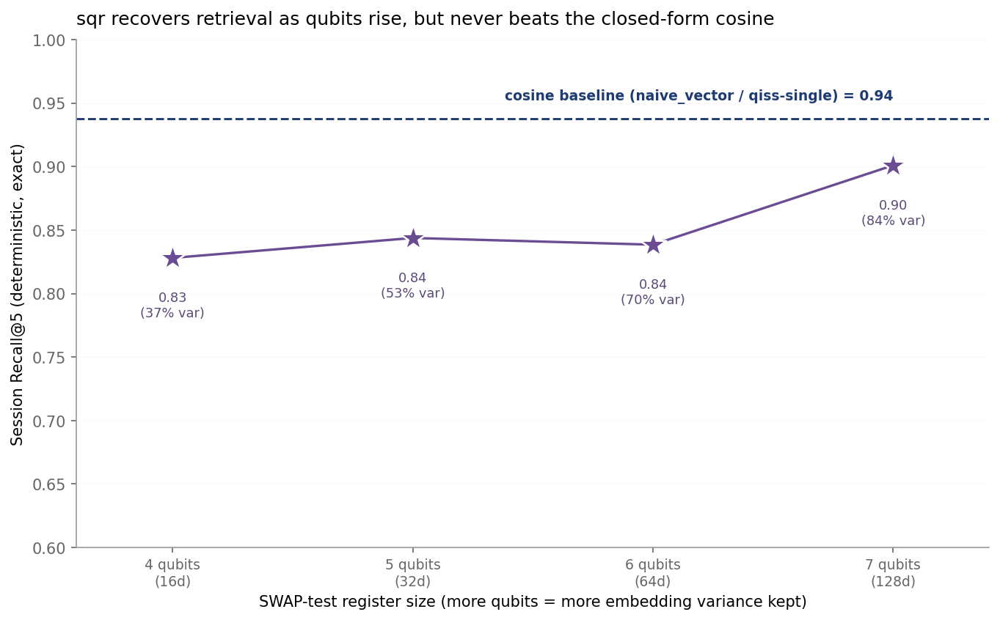
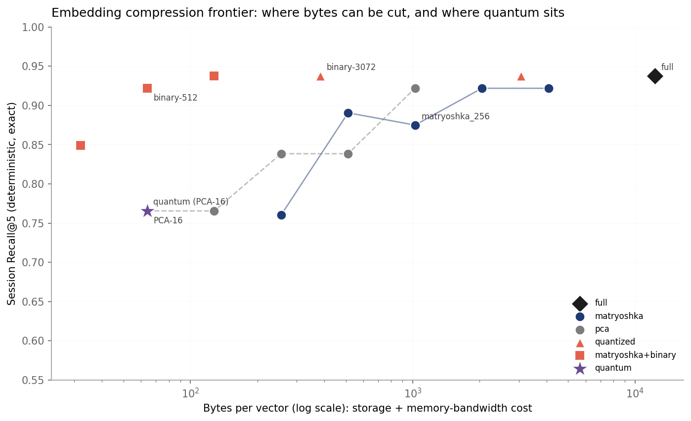

# Quantum memory in Memory Arena: what we found, and why

Memory Arena ships two quantum rerankers, `qiss` (quantum-inspired, pure NumPy)
and `sqr` (a real SWAP-test circuit on the Qiskit Aer simulator). This note is
the honest writeup of what they do, why they do not beat a plain vector search,
how that matches the published literature, and where the real retrieval cost
lever actually is.

## The headline: no advantage over a 30-line cosine search

On LongMemEval-S (16 questions, 4 categories, top_k=5):

| Strategy | Accuracy | Recall@5 | What it is |
| --- | --- | --- | --- |
| `naive_vector` | 49.2% | 0.87 | plain cosine over text-embedding-3-large |
| `qiss` | 50.5% | 0.85 | reranks by quantum fidelity (cosine squared) |
| `sqr` | 40.4% | 0.67 | SWAP-test fidelity on PCA-reduced amplitude states |

All three figures are 3-seed bootstrap means except `sqr` (single seed). `qiss`
ties `naive_vector`: both 3-seed means sit inside a 95% CI of roughly [33%, 68%]
at this N, and `qiss` retrieves the same documents by construction, so its
Recall@5 matches `naive_vector` within retrieval noise. `sqr` is worse. Neither
beats the baseline.



`sqr` recovers retrieval as you add qubits (its Recall@5 climbs from 0.83 at 4
qubits to 0.90 at 7 qubits as the kept PCA variance rises from 37% to 84%), but
the cosine baseline ceiling stays above every point.

## Why, from first principles

1. **Quantum fidelity is cosine.** For two L2-normalized vectors,
   `|<q|d>|^2 = cos^2(theta)`, a monotone of cosine. Ranking by quantum fidelity
   gives cosine's exact order. `qiss` is cosine with a square on it; `sqr` is
   cosine computed on lossy PCA vectors. You cannot out-rank cosine by
   recomputing cosine.
2. **The interference is not quantum.** The multi-query superposition score
   `|sum a_i <q_i|d>|^2` is the square of a classical weighted sum of cosines.
   The deterministic experiment confirms it is inert: coherent superposition
   equals the incoherent mixture in every cell, and both stay below single-query
   cosine.
3. **The loss in `sqr` is purely the encoding.** Amplitude encoding forces a PCA
   squeeze of 3072 dims into 16 (4 qubits), which keeps only 36% of the variance
   (`results/longmemeval-s_quantum_diagnostics.json`). The SWAP test itself is
   exact; the qubit budget is the only knob.
4. **There is no reranker-side fix.** Headroom does exist (multi-session
   reasoning: cosine 0.812 vs a perfect-rerank ceiling of 0.938, +12.5pp), but
   the gold sessions cosine ranks low are low because they phrase the same
   concept in different words. Every embedding-similarity score, including the
   density matrix `<q|rho|q>` and centroid cosine, ranks them equally low: all
   tie at 0.812 there (`results/longmemeval-s_quantum_headroom.json`). The
   bottleneck is the embedding's semantic coverage, not the scoring math.

## How this matches the literature

Our result independently reproduces the mainstream finding, on a setting the
literature has not actually benchmarked (we found no quantum-RAG or
quantum-reranking benchmarks):

- The SWAP test on amplitude-encoded vectors returns their state overlap, which
  for normalized vectors is cosine similarity. This is textbook.
- Kübler, Buchholz and Schölkopf (NeurIPS 2021), *The Inductive Bias of Quantum
  Kernels*: evaluating inner products in a huge space "by itself does not
  guarantee a quantum advantage"; you only win if the kernel's function space is
  low-dimensional and classically hard, which cosine over embeddings is not.
- *Exponential concentration in quantum kernel methods* (Nature Communications,
  2024): highly expressive, unstructured embeddings drive kernel values toward a
  constant; "unstructured data-embeddings should generally be avoided."
- Aaronson's *Read the Fine Print* (2015): loading high-dimensional classical
  data into a quantum state is itself a bottleneck, which negates speedups. Our
  PCA tax is the concrete instance.
- Where quantum ideas do help IR is a different mechanism than ours: the Quantum
  Probability Ranking Principle (Zuccon and Azzopardi, ECIR 2010) uses
  interference between documents for diversity and novelty, and Sordoni, Nie and
  Bengio's Quantum Language Model (SIGIR 2013) uses density matrices for term
  dependencies over a word space. Neither is query-document relevance fusion
  over near-collinear dense sentence embeddings, so our null is consistent.
- The 2024 to 2026 quantum-NLP consensus matches: quantum semantic-similarity
  circuits give no speedup or accuracy gain over classical cosine, and
  quantum-inspired embeddings tie classical to within a fraction of a percent.

## The cost connection: where bytes can actually be cut

In a RAG pipeline the similarity computation, the only thing quantum touches, is
a rounding error next to LLM generation tokens and embedding storage. The real
retrieval cost lever is compression. We mapped the frontier by ranking turns in
the compressed representation (store compressed, search compressed) and measuring
deterministic Recall@5.



- Binary quantization holds full Recall@5 (0.938) at 384 bytes (32x smaller) and
  128 bytes (96x, Matryoshka plus binary), and 0.922 at 64 bytes.
- Matryoshka truncation (native to text-embedding-3-large) holds to about 256
  dims; we verified truncate-and-renormalize equals the API `dimensions` output
  (cosine 1.0000).
- The quantum encoding (PCA-16 amplitude state, verified rank-identical to the
  real SWAP test) gets 0.766 at 64 bytes, beaten by classical binary_512 (0.922
  at the same 64 bytes) and even binary_256 (0.849 at half the bytes).

So even on the cost axis quantum theoretically claimed (packing many dims into
few qubits), it is a dominated point on a frontier classical compression
navigates far better.

## Reproduce

```bash
python scripts/quantum_experiments.py longmemeval-s     # interference + sqr-vs-qubits
python scripts/quantum_headroom.py longmemeval-s        # headroom + density matrix
python scripts/quantum_diagnostics.py longmemeval-s     # PCA variance, SWAP error vs shots
python scripts/compression_frontier.py longmemeval-s    # recall@5 vs bytes/vector
```

Results land in `results/longmemeval-s_quantum_*.json` and
`results/longmemeval-s_compression_frontier.json`; charts in `docs/`.

## Sources

- Kübler, Buchholz, Schölkopf, *The Inductive Bias of Quantum Kernels*, NeurIPS
  2021. <https://arxiv.org/abs/2106.03747>
- *Exponential concentration in quantum kernel methods*, Nature Communications
  2024. <https://arxiv.org/abs/2208.11060>
- Aaronson, *Read the Fine Print*, Nature Physics 2015.
- Sordoni, Nie, Bengio, *Modeling term dependencies with quantum language models
  for IR*, SIGIR 2013.
  <https://www.semanticscholar.org/paper/881b151bc29739a6c224f21da13407fd4d02483d>
- Zuccon, Azzopardi, *Using the Quantum Probability Ranking Principle to Rank
  Interdependent Documents*, ECIR 2010.
  <https://dl.acm.org/doi/10.1007/978-3-642-12275-0_32>
- *Binary and Scalar Embedding Quantization for Faster and Cheaper Retrieval*,
  Hugging Face. <https://huggingface.co/blog/embedding-quantization>
- *Combining Matryoshka with Binary Quantization*, Vespa.
  <https://blog.vespa.ai/combining-matryoshka-with-binary-quantization-using-embedder/>
